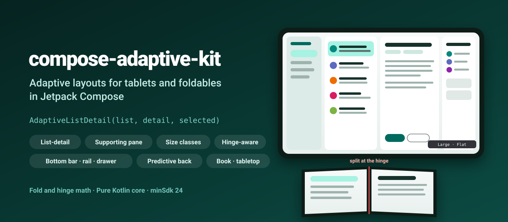
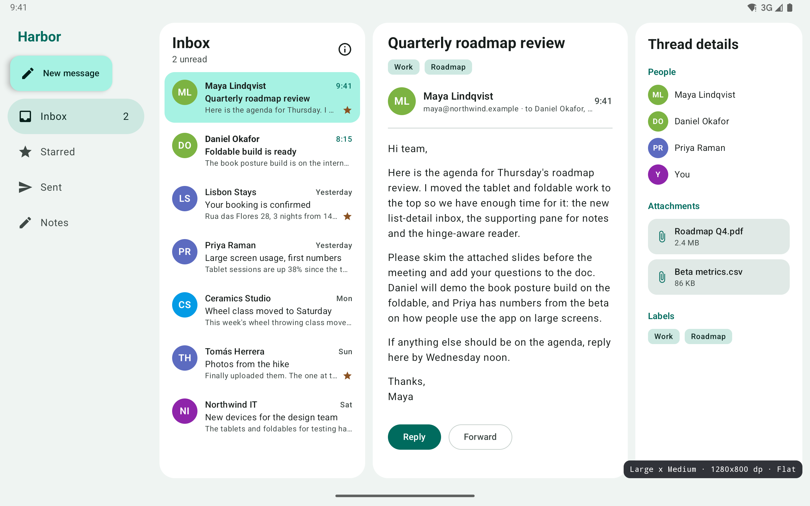
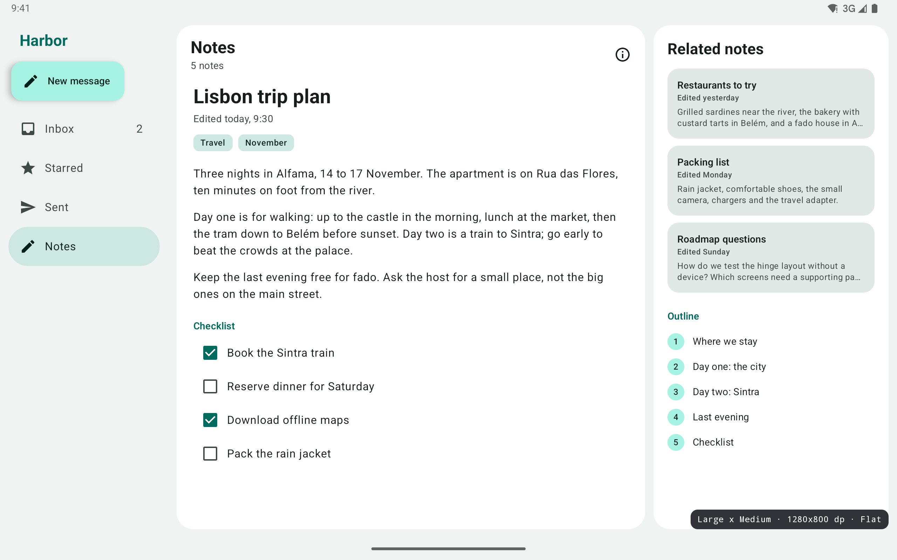
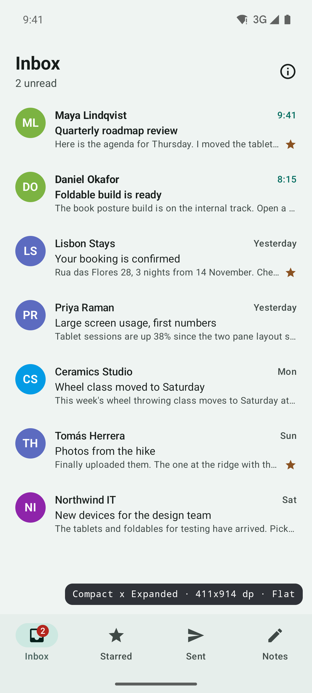
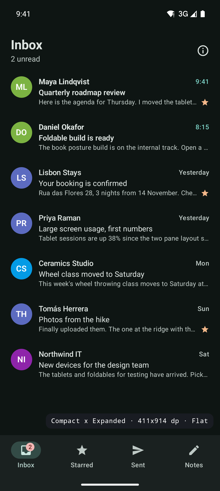
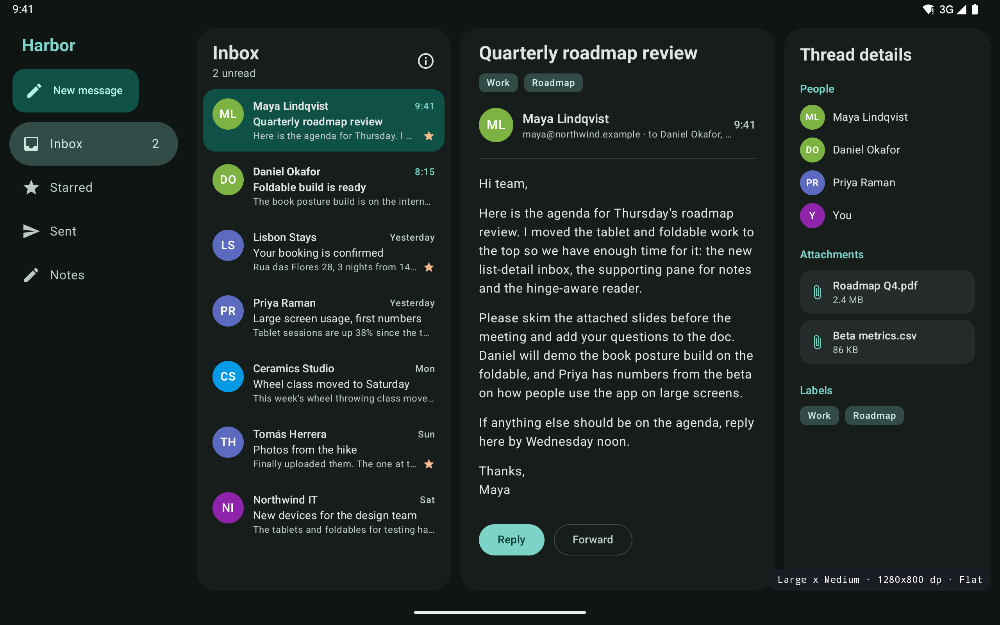
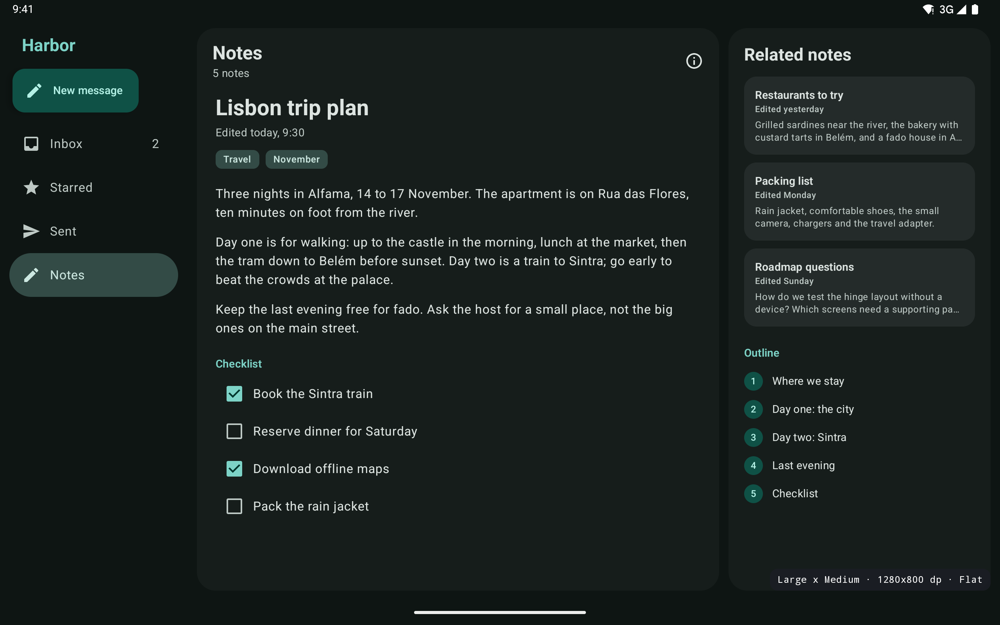

<p align="center">
  
</p>

<p align="center">
  <a href="https://github.com/halilozel1903/compose-adaptive-kit/actions/workflows/ci.yml"></a>
  <a href="https://jitpack.io/#halilozel1903/compose-adaptive-kit"></a>
  
  
  
  
  <a href="LICENSE"></a>
</p>

**compose-adaptive-kit** makes a Compose app feel at home on phones, tablets and foldables. One `AdaptiveListDetail` shows a list on a phone, list and detail side by side on a tablet and a third pane when there is room; on a foldable in book posture it splits exactly at the hinge. `SupportingPaneLayout` puts related content next to or under the main pane, `HingeAwareSplit` keeps content off a hinge, and `AdaptiveNavigation` switches between a bottom bar, a rail and a drawer. `rememberWindowLayoutInfo()` gives you the Material 3 window size class and the posture (flat, tabletop, book) from Jetpack WindowManager. The decisions are made in a small pure Kotlin module with unit tests.

```kotlin
var selectedId by rememberSaveable { mutableStateOf<Long?>(null) }

AdaptiveListDetail(
    list = { MailList(onOpen = { selectedId = it.id }) },
    detail = { mail -> MailDetail(mail) },
    selected = mails.firstOrNull { it.id == selectedId },
    onBack = { selectedId = null },          // compact: back (with predictive back) returns to the list
    extra = { mail -> ThreadDetails(mail) }, // a third pane on wide windows
)
```

## Screenshots

Captured from the sample app (a fictional mail and notes app) on Android emulators by CI. The label in the corner is the sample's debug overlay: size class, size in dp and posture.

**Tablet, list-detail:** inbox, message and thread details in three panes, with the navigation drawer.



**Tablet, supporting pane:** a note with related notes and its outline in the supporting pane.



| Phone (compact) | Phone, dark | Tablet list-detail, dark | Tablet supporting pane, dark |
| :---: | :---: | :---: | :---: |
|  |  |  |  |

## Features

- **Window size classes**: Material 3 widths (Compact below 600 dp, Medium, Expanded from 840, Large from 1200, Extra-large from 1600) and heights (Compact below 480, Medium, Expanded from 900), from the real window size, so multi-window and freeform windows work.
- **Posture**: flat, tabletop (half opened, horizontal fold) and book (half opened, vertical fold), plus the fold's bounds, orientation, occlusion and whether it separates the window, from Jetpack WindowManager's `WindowInfoTracker`.
- **`AdaptiveListDetail`**: one, two or three panes from the space it gets, with list and detail ratios and minimum widths you can tune. On compact windows the detail covers the list and back returns to it with the **predictive back** animation (shrink, shift and scrim, following the gesture on Android 14+). The list keeps its scroll position when the layout changes.
- **`SupportingPaneLayout`**: main and supporting panes side by side on wide windows, stacked on tall narrow ones, main only when there is no room.
- **Hinge aware**: on a separating fold or hinge the list-detail and supporting layouts split exactly at it, side by side in book posture and top and bottom in tabletop posture. `HingeAwareSplit` does the same for any two composables.
- **`AdaptiveNavigation`**: a bottom navigation bar on compact widths, a navigation rail on medium widths and short windows (phones in landscape), a permanent drawer on expanded and larger, with badges and a header slot.
- **Debug overlay**: `AdaptiveDebugOverlay` shows `Large x Medium · 1280x800 dp · Flat` in a corner and draws the fold, handy while you build layouts.
- **Lightweight**: Compose, Material 3, `activity-compose` (predictive back) and `androidx.window`. No dependency on `material3-adaptive`; the layouts are this library's own.
- **Pure Kotlin core** (`compose-adaptive-kit-core`): size classes, pane decisions, fold geometry, back state and predictive back math, unit tested and usable from any JVM module.

## Installation

Add JitPack to `settings.gradle.kts`:

```kotlin
dependencyResolutionManagement {
    repositories {
        google()
        mavenCentral()
        maven("https://jitpack.io")
    }
}
```

Then the dependency:

```kotlin
dependencies {
    implementation("com.github.halilozel1903.compose-adaptive-kit:compose-adaptive-kit:1.0.0")
    // Pure Kotlin layout math only (for JVM/KMP modules or your own layouts):
    // implementation("com.github.halilozel1903.compose-adaptive-kit:compose-adaptive-kit-core:1.0.0")
}
```

> The build is also set up for Maven Central (`io.github.halilozel1903:compose-adaptive-kit`) via the vanniktech publish plugin.

For predictive back on Android 13 and 14, opt in with `android:enableOnBackInvokedCallback="true"` on your `<application>` (it is the default from Android 15 when you target it).

## Usage

**Window size class and posture**

```kotlin
val info = rememberWindowLayoutInfo()

info.sizeClass.widthClass                                   // Compact, Medium, Expanded, Large or ExtraLarge
info.sizeClass.heightClass                                  // Compact, Medium or Expanded
info.sizeClass.isWidthAtLeast(WindowWidthClass.Expanded)    // true on tablets in landscape
info.posture                                                // Flat, Tabletop or Book
info.fold                                                   // bounds, orientation, state, occlusion, isSeparating
info.navigationType                                         // BottomBar, Rail or Drawer
info.label()                                                // "Large x Medium · 1280x800 dp · Flat"

if (info.posture == Posture.Tabletop) VideoAboveControls() else VideoWithOverlayControls()
```

**List-detail**

```kotlin
AdaptiveListDetail(
    list = { MailList(onOpen = { selectedId = it.id }) },
    detail = { mail -> MailDetail(mail) },
    selected = selectedMail,
    onBack = { selectedId = null },
    extra = { mail -> ThreadDetails(mail) },                  // optional third pane
    detailPlaceholder = { Text("Select a message") },          // two panes, nothing selected
    config = PaneConfig(
        listRatio = 0.32f,       // the list's share of the width...
        minListWidth = 280f,     // ...kept between these (dp)
        maxListWidth = 420f,
        minDetailWidth = 360f,
        minExtraWidth = 260f,
        spacing = 12f,           // gap between panes (dp)
    ),
)
```

Inside a pane, `LocalPaneLayout.current` tells you the mode (`Single`, `ListDetail` or `ThreePane`) and the pane widths, for example to show a back button only in `Single` mode or to show the extra pane's content inline when it is not visible:

```kotlin
@Composable
fun MailDetail(mail: Mail) {
    val layout = LocalPaneLayout.current
    if (layout.mode == PaneMode.Single) BackButton()
    MessageBody(mail)
    if (layout.mode != PaneMode.ThreePane) Attachments(mail)
}
```

**Supporting pane**

```kotlin
SupportingPaneLayout(
    main = { NoteEditor(note) },
    supporting = { RelatedNotes(note) },
    showSupporting = true,                                  // false: main pane only
    config = SupportingPaneConfig(supportingRatio = 0.33f, minSupportingWidth = 280f, spacing = 12f),
)
```

**Split at the hinge**

```kotlin
HingeAwareSplit(
    first = { VideoPlayer() },
    second = { PlayerControls() },
    fallbackDirection = SplitDirection.Stacked,   // without a separating hinge
    fallbackRatio = 0.6f,
    spacing = 8.dp,
)
```

With a vertical hinge (book posture, dual screens) the panes are side by side and end exactly at the hinge; with a horizontal one (tabletop) they are stacked.

**Navigation**

```kotlin
AdaptiveNavigation(
    items = listOf(
        AdaptiveNavItem("inbox", "Inbox", InboxIcon, badgeCount = 2),
        AdaptiveNavItem("starred", "Starred", StarIcon),
        AdaptiveNavItem("notes", "Notes", NotesIcon),
    ),
    selectedKey = section,
    onSelect = { section = it },
    header = { ComposeButton() },                 // top of the rail and the drawer
) {
    Screen(section)
}
```

Pass `navigationType = NavigationType.Rail` (or `BottomBar`, `Drawer`) to choose yourself.

**Debug overlay**

```kotlin
Box(Modifier.fillMaxSize()) {
    App()
    if (BuildConfig.DEBUG) AdaptiveDebugOverlay(alignment = Alignment.BottomEnd)
}
```

## The core module

`compose-adaptive-kit-core` has no Android or Compose dependency. The composables are built on it, and you can use it for your own layouts or tests:

```kotlin
WindowSizeClass(widthDp = 1280f, heightDp = 800f).widthClass       // Large
NavigationType.forSizeClass(WindowSizeClass(915f, 412f))            // Rail (phone in landscape)

PaneLayoutCalculator.compute(width = 1016f, PaneConfig(spacing = 12f), hasExtra = true)
// PaneLayout(mode = ThreePane, listWidth = 325.1, detailWidth = 402.7, extraWidth = 264.2, ...)

val fold = FoldInfo(Bounds(1104f, 0f, 1104f, 1840f), FoldOrientation.Vertical, FoldState.HalfOpened)
FoldGeometry.posture(fold)                                          // Book
val hinge = FoldGeometry.hingeIn(fold, container = Bounds(0f, 0f, 2208f, 1840f), scale = 2.625f)
HingeSplit.compute(width = 841f, height = 701f, hinge = hinge)      // 420.6 | 0 | 420.4, alignedToHinge
FoldGeometry.avoidHinge(start = 400f, size = 200f, containerSize = 841f, hinge = hinge)

ListDetailNavigation.visiblePanes(PaneMode.Single, hasSelection = true)    // [Detail]
ListDetailNavigation.handlesBack(PaneMode.ListDetail, hasSelection = true) // false: back goes to the system
PredictiveBackMath.transform(progress = 0.5f, edge = SwipeEdge.Left, width = 412f)
```

| API | What it does |
| --- | --- |
| `WindowSizeClass`, `WindowWidthClass`, `WindowHeightClass` | Material 3 breakpoints for widths and heights |
| `AdaptiveWindowInfo` | Size class, density and fold together, with `posture`, `navigationType` and `label()` |
| `PaneLayoutCalculator`, `PaneConfig`, `PaneLayout` | One, two or three panes with ratios, minimum and maximum widths, spacing and hinge splits |
| `SupportingPaneCalculator`, `SupportingPaneConfig` | Side by side, stacked or main only, with hinge splits |
| `FoldGeometry`, `FoldInfo`, `HingeSpan` | Separating folds, postures, a hinge in a container's coordinates, safe regions, moving content off the hinge |
| `HingeSplit` | Two pane split exactly at a hinge, or by ratio |
| `ListDetailNavigation` | Which panes are visible and whether back is handled |
| `PredictiveBackMath` | Scale, shift, scrim and corner rounding along a back gesture |
| `NavigationType` | Bottom bar, rail or drawer for a size class |

## Sample app

The `sample` module is Harbor, a fictional mail and notes app: Inbox, Starred and Sent use `AdaptiveListDetail` with a thread details pane, Notes uses `SupportingPaneLayout` with related notes, and `AdaptiveNavigation` switches between bottom bar, rail and drawer. The info button in the list header toggles the debug overlay.

Taps can't be timed reliably through adb, so the sample opens a screen from an intent extra (used by `scripts/screenshots.sh`); scenes turn the debug overlay on:

```bash
./gradlew :sample:installDebug
adb shell am start -n io.github.halilozel1903.adaptive.sample/.MainActivity --es scene listdetail
adb shell am start -n io.github.halilozel1903.adaptive.sample/.MainActivity --ez debug true
```

`scene` is one of `listdetail` (a message open), `supporting` (a note open) or `compact`. CI captures `listdetail` and `supporting` on a Pixel Tablet emulator in landscape and `compact` on a Pixel 7, in light and dark mode, checks each capture for the screen's text and fails on blank images.

Try it on a foldable emulator (Pixel Fold, or the resizable emulator in foldable mode) and fold it halfway: the panes move to either side of the fold.

## Project structure

| Module | What it is |
| --- | --- |
| `adaptive-core` | Pure Kotlin: size classes, pane and supporting pane decisions, fold geometry, hinge split, back state, predictive back math. Published as `compose-adaptive-kit-core` |
| `adaptive` | Compose: `rememberWindowLayoutInfo`, `AdaptiveListDetail`, `SupportingPaneLayout`, `HingeAwareSplit`, `AdaptiveNavigation`, `AdaptiveDebugOverlay`. Published as `compose-adaptive-kit` |
| `sample` | Harbor, a mail and notes app for phones, tablets and foldables, with screenshot scenes |

## Tech stack

Kotlin 2.4 · AGP 9.4 with built-in Kotlin · Gradle 9.6 · Jetpack Compose (BOM 2026.09) · Material 3 · Jetpack WindowManager (`WindowInfoTracker`, `WindowMetricsCalculator`) · `PredictiveBackHandler` · `SaveableStateHolder` · GitHub Actions with Android emulators

## License

MIT. See [LICENSE](LICENSE).
